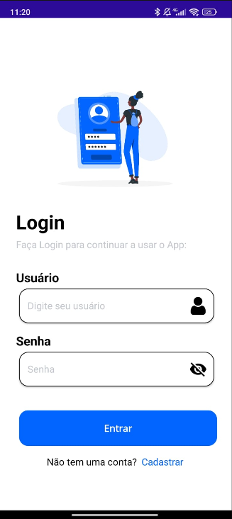
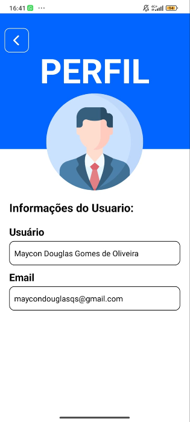
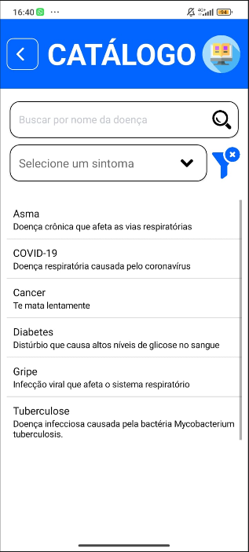

# Sintomas & Doenças

Aplicativo multiplataforma desenvolvido com **.NET MAUI** como projeto acadêmico. Atualmente, ele disponibiliza uma experiência inicial de autenticação: cadastro de usuários, login local e acesso à tela inicial.

> Este projeto está em evolução. A autenticação atual é demonstrativa e usa um banco SQLite local no dispositivo.

## Funcionalidades

- Cadastro de usuários com nome único.
- Login com validação de usuário e senha.
- Alternância de visibilidade da senha.
- Persistência local usando SQLite.
- Interface disponível para Android, iOS, macOS (Mac Catalyst) e Windows.

## Telas do aplicativo

Adicione as capturas de tela na pasta [`docs/images`](docs/images), usando os nomes abaixo. Elas serão exibidas automaticamente nesta seção quando o repositório for publicado.

| Login | Perfil | Catálogo de doenças |
| :---: | :---: | :---: |
|  |  |  |

Formatos recomendados: PNG ou JPG, em orientação vertical e sem dados pessoais visíveis.

## Tecnologias

- [.NET 8](https://dotnet.microsoft.com/download/dotnet/8.0)
- [.NET MAUI](https://learn.microsoft.com/dotnet/maui/)
- [sqlite-net-pcl](https://github.com/praeclarum/sqlite-net)
- XAML e C#

## Estrutura do projeto

```text
SintomasDoencas/
├── Platforms/              # Configurações específicas de cada plataforma
├── Properties/             # Perfis de inicialização
├── Resources/              # Ícones, imagens, fontes e estilos
│   ├── AppIcon/
│   ├── Fonts/
│   ├── Images/
│   ├── Splash/
│   └── Styles/
├── App.xaml                # Recursos globais da aplicação
├── AppShell.xaml           # Navegação inicial
├── MainPage.xaml           # Tela de login
├── Cadastro.xaml           # Tela de cadastro
├── Inicial.xaml            # Tela inicial após o login
├── Pessoa.cs               # Modelo persistido no SQLite
└── SintomasDoencas.csproj  # Configuração do projeto
```

## Pré-requisitos

- [.NET SDK 8](https://dotnet.microsoft.com/download/dotnet/8.0) ou compatível.
- Workload do .NET MAUI instalado.
- Para Android, um emulador ou dispositivo configurado; para Windows, o SDK do Windows correspondente.

Confira os workloads instalados:

```bash
dotnet workload list
```

Caso necessário, instale o MAUI:

```bash
dotnet workload install maui
```

## Como executar

1. Clone o repositório e acesse a pasta do projeto.

   ```bash
   git clone https://github.com/SEU-USUARIO/sintomas-doencas.git
   cd sintomas-doencas
   ```

2. Restaure as dependências.

   ```bash
   dotnet restore
   ```

3. Execute para a plataforma desejada. Exemplo para Windows:

   ```bash
   dotnet build -f net8.0-windows10.0.19041.0
   ```

Também é possível abrir `SintomasDoencas.sln` no Visual Studio com o suporte a desenvolvimento .NET MAUI instalado e selecionar um destino de execução.

## Dados locais e segurança

Os usuários são armazenados no arquivo `pessoas.db3`, dentro do diretório de dados da aplicação. Esse arquivo é criado em tempo de execução e não é versionado.

As senhas são mantidas em texto simples apenas por se tratar de um protótipo. Antes de distribuir o aplicativo, substitua esse mecanismo por hash de senha com salt e considere uma solução de autenticação apropriada ao produto.

